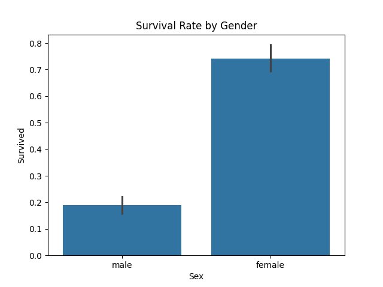
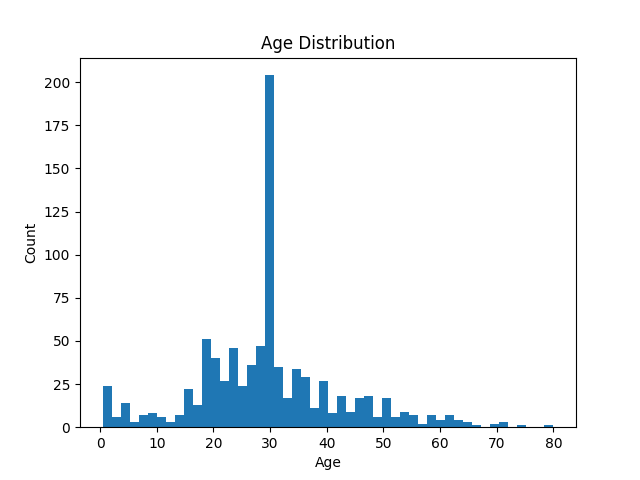

# titanic-data-cleaning
Data Engineering Project Showcasing Python/SQL and Data Cleaning Skills
# Titanic Data Cleaning and Visualization

This project cleans the Titanic dataset, loads it into a SQLite database, and generates visualizations to explore survival patterns. It demonstrates data engineering skills in Python, SQL, and visualization, preparing data for business analytics.

## Setup
1. Clone the repository.
2. Create a virtual environment: `python -m venv venv`
3. Activate it: `venv\Scripts\activate` (Windows) or `source venv/bin/activate` (Mac/Linux)
4. Install dependencies: `pip install -r requirements.txt`
5. Run the script: `python clean_titanic.py`

## Results
- Cleaned dataset: `titanic_cleaned.csv`
- SQLite database: `titanic.db`
- SQL queries: `queries.sql`
- Visualizations:
  - Survival rate by gender: 
  - Age distribution: 

## Stakeholder Note
This pipeline ensures clean, reliable data for survival analysis, enabling business teams to identify key trends (e.g., higher survival rates for females).

## License
This project is licensed under the MIT License - see the [LICENSE](LICENSE) file for details.

## Dataset
The Titanic dataset is sourced from [Kaggle](https://www.kaggle.com/c/titanic/data) and subject to their terms.